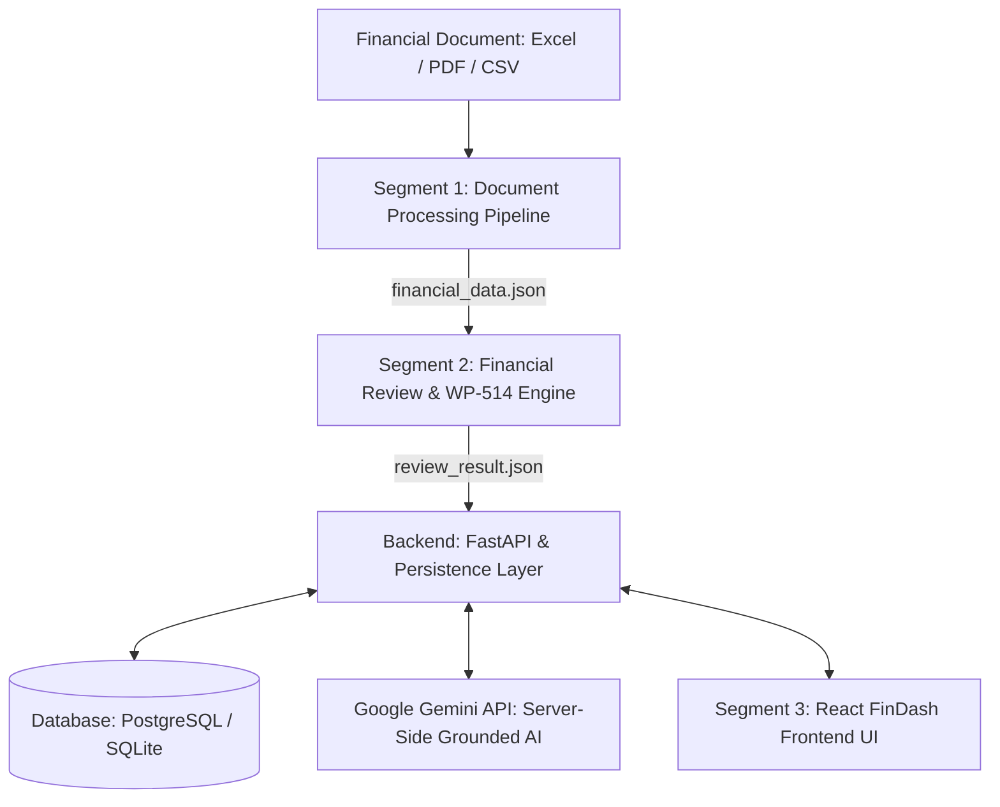

# Finance Analyzer — Automated Financial Statement & WP-514 Audit Platform

[](tests/test_browser_real_e2e.py)
[](schema/review_schema.py)
[](backend/main.py)
[](frontend/FinancialAuditDashboard.jsx)
[](LICENSE)

An enterprise-grade, end-to-end financial audit and review platform. Finance Analyzer automatically ingests complex financial statements (Excel, PDF, CSV, Markdown), extracts and normalizes accounting schedules across multiple reporting periods, executes **10 automated WP-514 compliance and integrity procedures**, calculates key financial ratios, detects anomalies, and presents an interactive executive dashboard with grounded AI assistance and PDF export capabilities.

---

## Architecture Overview



### Complete System Breakdown
1. **Segment 1 — Document Processing Engine**:
   * Multi-format document parser (`.xlsx`, `.xls`, `.pdf`, `.csv`, `.md`).
   * Normalizes line items into standardized accounting contracts.
   * Extracts Balance Sheet, Income Statement, and Cash Flow Statement across comparative periods.
   * Chunks footnotes and disclosure notes for provenance tracking.

2. **Segment 2 — Financial Review & WP-514 Compliance Engine**:
   * **10 Automated Audit Procedures**:
     1. Mathematical Accuracy & Subtotal Verification
     2. Cash Flow Reconciliation (Operating, Investing, Financing movements)
     3. Prior-Year Comparative Tie-Out
     4. Internal Consistency & Inter-Statement Cross-References
     5. Analytical Comparison & YoY Growth Trend Analysis
     6. Key Financial Ratios (Liquidity, Solvency, Profitability, Efficiency)
     7. Unusual Fluctuations Scanner
     8. Unusual Gains & Core Divergence Detection
     9. Related Party Disclosures & Reconciliation
     10. Document & Narrative Quality Gate
   * Objective, weighted scoring algorithm producing a standardized **0–100 Audit Score**.
   * Severity classification: `CRITICAL`, `HIGH`, `REVIEW`, `PASSED`.

3. **Segment 3 & Backend — Multi-Tenant Web Platform**:
   * **FastAPI Backend**: Protected REST endpoints, pipeline orchestration, background task processing.
   * **Authentication & Security**: Argon2id password hashing, signed JWT Bearer tokens, strict multi-tenant tenant isolation.
   * **Interactive FinDash UI**: React 18 SPA with overview dashboard, WP-514 Review Matrix, General Financial Ledger, Audit Integrity view, Audit Report with PDF export, and Audit History modal.
   * **Grounded AI Assistant**: Server-side Google Gemini integration grounded strictly in the active audit workpapers (API keys remain secure on the backend).

---

## Quick Start Guide

### Prerequisites
* **Python 3.10+**
* **Node.js 18+** & npm

---

### 1. Installation

Clone the repository:
```bash
git clone https://github.com/Tungsten073/UIfinance.git
cd UIfinance
```

#### Backend Setup:
```bash
# Create and activate Python virtual environment
python -m venv venv
source venv/bin/activate    # On Windows: venv\Scripts\activate

# Install dependencies
pip install -r requirements.txt

# Copy environment configuration
cp .env.example .env
```

#### Frontend Setup:
```bash
cd frontend
npm install
cd ..
```

---

### 2. Running Locally

#### Start the Backend API (Port 8000):
```bash
uvicorn backend.main:app --host 127.0.0.1 --port 8000 --reload
```

#### Start the Frontend UI (Port 5173):
```bash
npm --prefix frontend run dev
```

Open [http://localhost:5173](http://localhost:5173) in your browser.

* **Demo Account Credentials**:
  * **Email**: `auditor@example.com`
  * **Password**: `DemoPassword123!`
  * *(Or click "Sign in as Lead Auditor" on the login screen for 1-click access)*

---

### 3. Command Line Execution (CLI Pipeline)

You can also execute individual segments directly from the terminal without starting the web servers:

#### Run Document Extraction (Segment 1):
```bash
python run_segment1.py path/to/financial_statement.xlsx --output outputs/financial_data.json
```

#### Run Financial Review (Segment 2):
```bash
python run_segment2.py outputs/financial_data.json --output outputs/review_result.json
```

---

## Audit Procedures & WP-514 Coverage

| ID | Procedure / Category | Description | Tolerance / Rule |
|:---|:---|:---|:---|
| **MA** | Mathematical Accuracy | Horizontal and vertical arithmetic verification across statements | $\le 0.1\%$ deviation |
| **CF** | Cash Flow Reconciliation | Operating + Investing + Financing + Forex = Closing Cash Balance | Exact reconciliation |
| **PY** | Prior-Year Tie-Out | Comparative figures match historical annual filings | Exact match |
| **IC** | Internal Consistency | Cross-statement line-item validation (e.g., Net Income to Retained Earnings) | Zero discrepancy |
| **AC** | Analytical Comparison | Compound Annual Growth Rate (CAGR) and YoY variance tracking | Trend baseline |
| **FR** | Key Financial Ratios | Computes 15 liquidity, solvency, leverage, and profitability ratios | Industry thresholds |
| **UF** | Unusual Fluctuations | Statistical z-score outlier detection on statement line items | $|z| > 2.5$ or $> 50\%$ variance |
| **UG** | Unusual Gains Scanner | Non-operating one-off gains vs operating profit divergence | Materiality index |
| **RP** | Related Party Disclosures | Note disclosure vs stated transaction balance reconciliation | Disclosed tie-out |
| **DQ** | Document & Language Quality | Spelling, grammar, structural completeness, footnote reference checks | Quality score |

---

## Test Suites & Validation

The project includes unit tests, regression suites, and Playwright Chromium real-browser verification tests:

```bash
# Run backend security and API unit tests
python -m unittest tests/test_auth_and_security.py

# Run regression benchmarks against Core Apex Datasets
python -m unittest tests/test_auth_e2e_verification.py

# Run complete Playwright Chromium real-browser E2E test
python tests/test_browser_real_e2e.py

# Run full Apex Auto Mobility product validation
python tests/test_apex_full_e2e.py
```

### Verified Regression Benchmarks
* `AUTO_ALL_PASS`: **100.0 / 100** (82 / 82 checks passed)
* `AUTO_REVIEW`: **96.61 / 100** (73 passed, 7 review, 2 failed)
* `AUTO_FAIL`: **53.03 / 100** (62 passed, 2 review, 18 failed)

---

## Production Deployment

Detailed production deployment instructions are available in [DEPLOYMENT.md](DEPLOYMENT.md).

### 1-Click Render Deployment
This repository includes a [`render.yaml`](render.yaml) Blueprint:
1. Link this repository on [Render](https://render.com/).
2. Select **New Blueprint Instance**.
3. Render automatically provisions the PostgreSQL database, FastAPI service, and static React frontend.

---

## License

This project is licensed under the MIT License — see the [LICENSE](LICENSE) file for details.
